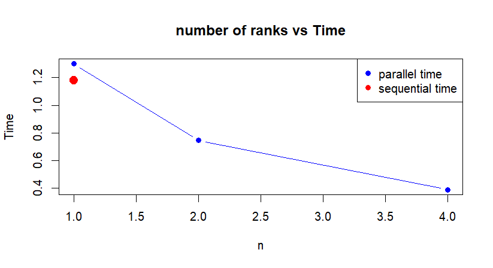

# Benchmark Results and Scalability Analysis (Challenge 3)

This file presents the results of the performance and scalability tests conducted for the **Matrix-Free Parallel Laplace Solver** (Challenge 3). The benchmark evaluates the execution times of both the sequential and hybrid parallel Jacobi iterations across different numbers of MPI processes.

## Test Configuration and Environment

- **Grid Size ($n$):** 100 (resulting in a grid of $100 \times 100$ nodes)
- **Tolerance:** $1 \times 10^{-5}$
- **Test Repetitions:** 20 iterations per benchmark run (averaging the execution times)
- **Forcing Function:** $f(x, y) = 8\pi^2 \sin(2\pi x) \sin(2\pi y)$
- **Hardware Platform:** Lenovo Laptop (see hw.info file)
- **Parallel Paradigm:** Hybrid MPI + OpenMP (tested with 1, 2, and 4 MPI ranks)

---

## Experimental Results

The following table summarizes the measured average execution times (in microseconds) for both the sequential implementation and the parallel implementation as a function of the number of MPI processes (`-np`).

| MPI Processes (`np`) | Sequential Time (Seconds) | Parallel Time (Seconds) |
|:-------------------:|:------------------------:|:-----------------------:|
| **1** | 1.179 s                                | 1.3000 s   |
| **2** | 1.360, s                               | 0.7463 s   |
| **4** | 1.494 s                                | 0.3901 s   |

---

## Scalability and Speedup Analysis

To evaluate the parallel performance, we analyze the **Speedup** ($S_p$).

We compute the speedup using two different baselines:
1. **Absolute Speedup ($S_p^{abs}$):** Compared against the pure, standalone sequential solver ($T_{seq} = 1,179,690$ $\mu$s).
2. **Relative Speedup ($S_p^{rel}$):** Compared against the parallel implementation running on a single rank ($T_{par}(1) = 1,300,000$ $\mu$s).

### 1. Performance Metrics Table

| MPI Processes (`np`) | Absolute Speedup ($S_p^{abs}$)  | Relative Speedup ($S_p^{rel}$) | 
|:-------------------:|:-------------------------------:|:----------------------------------:|
| **1** | 0.907                                 | 1.000                   | 
| **2** | 1.581                                 | 1.742                   | 
| **4** | 3.024                                 | 3.332                   |

### 2. Discussion of Findings

1. **Parallel Overhead ($np = 1$):**
   When running on a single process, the parallel implementation exhibits a slight overhead compared to the pure sequential code ($1.30$ s vs $1.18$ s). This is expected behavior due to the initialization of MPI structures, setting up buffer vectors (`displ_vector`, `sendcount_vector`), and calling `MPI_Scatterv`/`MPI_Gatherv` operations, which add overhead without any computational distribution.

2. **Speedup:**
   - **At $np = 2$ Processes:** The parallel execution time drops significantly from $1.30$ s to $0.746$ s. This yields an absolute speedup of **1.58x** and a relative speedup of **1.74x**, representing a very solid scaling behavior.
   - **At $np = 4$ Processes:** The execution time drops further to $0.390$ s. This results in an absolute speedup of **3.02x** and a relative speedup of **3.33x**.

3. **Analysis of the Sequential Time Inflation:**
   An interesting phenomenon observed is that the reported `Sequential Time` increases as the number of MPI processes increases (from $1.18$ s at $np=1$ to $1.49$ s at $np=4$). 
   
